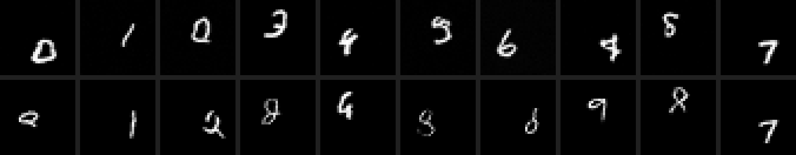

# 🎞️ MNISTDigitsToGIF

**A from-scratch video diffusion model that generates short clips of bouncing MNIST digits — trained end-to-end on a single 8 GB laptop GPU.**

You give it nothing but noise; a hand-written 3D U-Net DDPM denoises that noise into a 10-frame clip of a digit bouncing around the canvas. Nothing is hidden inside a pretrained model — the noising process, the denoising network, and the 1000-step sampling loop are all implemented by hand.

> 🎬 **Demo — per-digit generations, top row v1 (base 96) vs bottom row v0 (base 64):**



```
pure noise  [4, 1, 10, 32, 32]
  → 3D U-Net ε-prediction       (predict the noise at each step)
  → 1000-step DDPM reverse loop  (iteratively denoise)
  → EMA weights                  (cleaner, less jittery frames)
  → 10-frame GIF of a bouncing digit
```

---

## ✨ Features

- 🟢 **DDPM** — forward noising, reverse sampling, and ε-prediction objective.
- 🟢 **3D U-Net** — Conv3d residual blocks with timestep conditioning; downsamples space, preserves time.
- 🟢 **Synthetic Moving MNIST** — bouncing-digit clips generated on the fly, no dataset prep.
- 🟢 **EMA sampling** — exponential moving average of weights for cleaner generations.
- 🟢 **bf16 autocast** — stable mixed-precision training for the larger model.
- 🟢 **8 GB-friendly** — defaults fit comfortably on an RTX 4060 Laptop GPU.
- 🟢 **Reproducible sampling** — `--seed` flag for same-noise A/B comparisons.
- 🟢 **Comparison grids** — stitch generations into side-by-side GIF grids.

---

## 🧰 Tech stack

| Area | Tooling |
| --- | --- |
| Model & training | [PyTorch](https://pytorch.org/) |
| Data | [torchvision](https://pytorch.org/vision/) (MNIST) |
| Array ops | [NumPy](https://numpy.org/) |
| GIF I/O | [imageio](https://imageio.readthedocs.io/) |
| Language | [Python 3.12](https://www.python.org/) |

---

## 🛠️ How I built it (the process)

The whole thing started as a "can an 8 GB laptop actually do this?" experiment — I wanted to see whether a single RTX 4060 Laptop GPU could train *video* generation, not just images, without renting a cluster. So I deliberately kept everything tiny and from-scratch: synthetic Moving MNIST instead of a real video dataset, a pixel-space 3D U-Net, and a plain DDPM objective. The constraint *was* the project.

I built it in two passes. **v0** was the baseline — base-64 U-Net, raw weights, default settings — just to confirm the pipeline learned anything (it did: recognizable digits, but thin and wispy). For **v1** I made three changes, and the most interesting engineering was here: fitting the bigger model into 8 GB, sampling from **EMA** weights to clean up the per-step jitter, and the precision switch. My first v1 attempt used fp16 and trained fine until **epoch 9, when the base-96 activations overflowed fp16's narrow exponent range and the loss went to NaN**. That's why I switched to **bf16** — it keeps fp32's exponent range so the activations can't overflow, and it needs no loss scaling — then resumed from the last good checkpoint and trained cleanly to completion. The payoff: noticeably bolder, cleaner digits.

---

## 📚 What I learned

- **How DDPM actually works** — implementing the forward noising and reverse denoising.
- **EMA cleans up samples** — sampling from an exponential moving average of the weights reduces frame-to-frame jitter.
- **Loss flatlines, quality doesn't** — the MSE plateaus by ~epoch 3, yet sample quality keeps improving; the limit was model *capacity*, not undertraining.
- **bf16's exponent range matters** — the precision format, not just the bit count, is what made the bigger model train stably.

---

## 🚀 How it could be improved

- **Can't request a specific digit** — the model is *unconditional*, so you get whatever the noise falls toward. **Fix:** retrain as a **class-conditional** model (add a digit-label embedding alongside the timestep embedding, train with classifier-free guidance) so you can ask it to generate, say, a 7 on demand.
- **Thin/wispy strokes remain** — even v1 isn't perfectly crisp. **Fix:** more capacity, a longer schedule, or a self-conditioning / v-prediction objective.
- **Slow sampling** — full 1000-step DDPM reverse loop per clip. **Fix:** DDIM or another fast sampler to cut steps by ~10–50×.
- **Tiny canvas / single digit** — 32×32, one digit. **Fix:** scale `--size`, `--frames`, and `--digits` once more VRAM is available.
- **No quantitative metric** — quality is judged by eye. **Fix:** add FVD or a simple digit-classifier accuracy score.

---

## ▶️ How to run the project

### 1. Install deps

```
py -3.12 -m venv .venv
.\.venv\Scripts\Activate.ps1
pip install --upgrade pip
# CUDA build for an RTX 4060 — confirm the cuXXX tag at pytorch.org/get-started/locally
pip install torch torchvision --index-url https://download.pytorch.org/whl/cu126
pip install -r requirements.txt
```

> Need Python 3.12 first? `winget install Python.Python.3.12` (this project was built against 3.12, not 3.14).

### 2. Train

```
python video_diffusion.py train
```
Saves per-epoch checkpoints + sample GIFs. Defaults (base 64) fit ~4 GB; the v1 run used `--base 96`.

### 3. Generate from a checkpoint

```
python video_diffusion.py sample --ckpt checkpoints/ckpt_epoch30.pt --base 96 --n 4 --seed 1234
```
Writes `gen_0.gif … gen_{n-1}.gif`. Use `--seed` for reproducible noise (same-seed A/B comparisons).

<details>
<summary><b>Key options & defaults</b></summary>

| Flag | Default | Meaning |
| --- | --- | --- |
| `--size` | 32 | frame H×W |
| `--frames` | 10 | clip length T |
| `--digits` | 1 | digits per clip |
| `--base` | 64 | U-Net base channels (v1 used 96) |
| `--mults` | 1 2 4 | channel multipliers |
| `--timesteps` | 1000 | DDPM diffusion steps |
| `--batch` | 16 | ~4.1 GB / 8 GB VRAM |
| `--epochs` | 30 | |
| `--lr` | 2e-4 | AdamW |
| `--ema` / `--no-ema` | on | EMA of weights for sampling |
| `--seed` | none | reproducible sampling noise |
| `--resume <ckpt>` | — | continue training from a checkpoint |

Note: `--base` at sample time must match the checkpoint (64 for v0, 96 for v1).

</details>

<details>
<summary><b>Make a comparison grid</b></summary>

```
python make_grid.py --inputs gen_0.gif gen_1.gif gen_2.gif gen_3.gif --out grid.gif --cols 2
```
Stitches GIF clips into one animated grid (nearest-neighbor upscaled).

</details>

<details>
<summary><b>Project layout</b></summary>

```
video_diffusion.py   model + train/sample
make_grid.py         GIF grid stitcher
checkpoints/         ckpt_epoch30.pt (v1), ckpt_baseline_v0_e30.pt (v0)
logs/                training logs
samples_v0/          v0 per-epoch preview GIFs
samples_v1/          v1 per-epoch preview GIFs
generations/         comparison grids + source clips (see below)
v0.md / v1.md        per-run writeups
summary.md           v0 vs v1 comparison
```

Comparison artifacts in `generations/`:
- `grid_v1_vs_v0_seed1234.gif` — 2×4 same-seed grid (top v1, bottom v0)
- `comparison_by_digit.gif` — per-digit 0–9 grid (top v1, bottom v0)
- `v1_seed1234/`, `v0_seed1234/`, `by_digit/` — source clips

</details>

---
